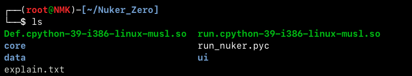
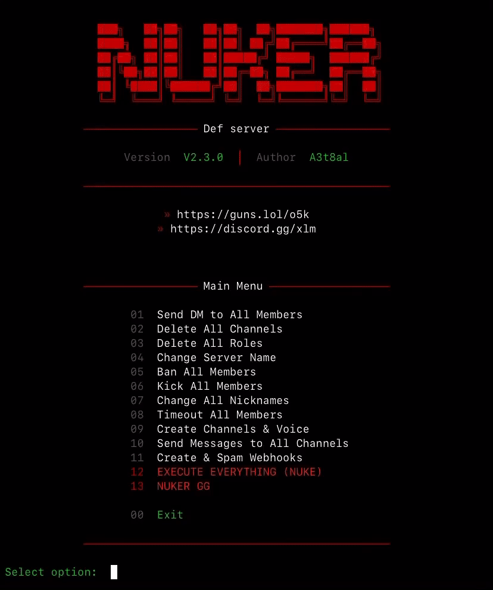

# Nuker Zero

[](https://github.com/A3t8al/Nuker-def-server)
[](#platform-support)
[](https://guns.lol/o5k)

## Description

**Nuker Zero** is a fast, encrypted, lightweight, and efficient Nuker tool written for Python 3.9. It supports iOS through iSH and runs natively on compatible i386 Linux environments.

## Screenshots





## Requirements

- Python 3.9
- i386 architecture
- musl libc environment
- Required Python packages:

```bash
pip install colorama pycryptodome requests
```

## Installation and Usage

### Method 1: Clone the Repository

```bash
git clone https://github.com/A3t8al/Nuker-def-server.git
cd Nuker-def-server
pip install colorama pycryptodome requests
python3 run_nuker.pyc
```

### Method 2: Download the ZIP Archive

1. Download the repository as a ZIP archive from [GitHub](https://github.com/A3t8al/Nuker-def-server).
2. Extract the ZIP file.
3. Open a terminal inside the extracted directory.
4. Install the required packages:

```bash
pip install colorama pycryptodome requests
```

5. Run the tool:

```bash
python3 run_nuker.pyc
```

## iOS (iSH) Installation

1. Install **iSH** from the Apple App Store.
2. Open iSH and update the package repository:

```bash
apk update
```

3. Install Python, pip, and Git:

```bash
apk add python3 py3-pip git
```

4. Install the required Python packages:

```bash
pip install colorama pycryptodome requests
```

5. Clone the repository:

```bash
git clone https://github.com/A3t8al/Nuker-def-server.git
cd Nuker-def-server
```

6. Run Nuker Zero:

```bash
python3 run_nuker.pyc
```

## Compatibility Note

The encrypted `.so` files are built specifically for:

```text
i386-linux-musl
```

They are not compatible with platforms using a different architecture or C library.

## Project Structure

```text
Nuker_Zero/
├── run_nuker.pyc                      # Entry point
├── run.cpython-39-i386-linux-musl.so  # Encrypted engine
├── Def.cpython-39-i386-linux-musl.so  # Encrypted helper module
├── core/                              # Encrypted core modules (4 .so files)
├── ui/                                # Encrypted interface modules (3 .so files)
├── data/                              # Local storage (not uploaded)
└── explain.txt
```

## Platform Support

| Platform | Support |
|---|---|
| iSH on iOS | Supported |
| Alpine Linux i386 | Supported |
| x86_64 Linux | Not supported |
| Termux ARM | Not supported |
| Windows | Not supported |
| macOS | Not supported |

The unsupported platforms cannot run Nuker Zero because the encrypted `.so` files were built for `i386-linux-musl`.

## Links

- GitHub: [A3t8al/Nuker-def-server](https://github.com/A3t8al/Nuker-def-server)
- Guns.lol: [guns.lol/o5k](https://guns.lol/o5k)
- Discord Server: [Join the Discord server](https://discord.gg/0197)

## Disclaimer

Nuker Zero is provided for educational purposes only. The developer is not responsible for any misuse, damage, or illegal activity caused by this project. Always use the tool responsibly and only in environments where you have explicit permission.
