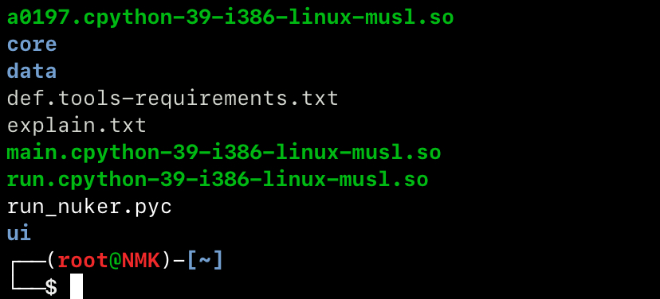
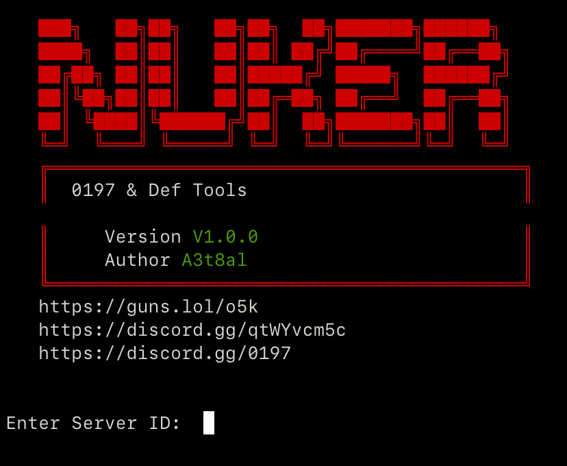

# Nuker Zero


**Nuker Zero** is a fast, encrypted, and modified version of the Nuker tool. It is designed to be lightweight and efficient, with support for iOS through iSH, Android through Termux, and Linux natively.

## Screenshots

### Tool Files



### Tool Interface



## Requirements

Before running the tool, make sure the following are installed:

- **Python 3**
  - Example for iSH: `apk add python3 py3-pip`
- **Zip/Unzip**
  - Example for iSH: `apk add zip unzip`

## Installation and Usage

### Download the Project from GitHub

You can download the project directly from the GitHub repository:

[Nuker-def-server on GitHub](https://github.com/A3t8al/Nuker-def-server.git)

#### Option 1: Clone the Repository with Git

```bash
git clone https://github.com/A3t8al/Nuker-def-server.git
cd Nuker-def-server
```

#### Option 2: Download as a ZIP File

1. Open the [GitHub repository](https://github.com/zzxey123xx/Nuker-def-server).
2. Select **Code**.
3. Select **Download ZIP**.
4. Extract the downloaded ZIP file.
5. Open the extracted project directory.

### Android Installation and Usage

The tool can be downloaded and used on Android through the [Termux](https://termux.dev/) terminal application.

#### 1. Install Termux

Download Termux from [F-Droid](https://f-droid.org/packages/com.termux/) or its [official GitHub repository](https://github.com/termux/termux-app). Avoid outdated or unofficial versions where possible.

#### 2. Update Termux Packages

Open Termux and run:

```bash
pkg update && pkg upgrade
```

#### 3. Install the Required Packages

```bash
pkg install git python unzip
```

#### 4. Download the Project

```bash
git clone https://github.com/zzxey123xx/Nuker-def-server.git
cd Nuker-def-server
```

#### 5. Read the Instructions

```bash
cat explain.txt
```

Follow the instructions in `explain.txt` to continue. Only use the tool on systems, servers, or accounts that you own or have explicit permission to test.

### Alternative: Install from a ZIP File

If you already have the ZIP archive, you can install the tool manually:

#### 1. Extract the Tool

```bash
unzip Nuker_V1.zip
```

When prompted for a password, enter:

```text
#def.tools.py-v1.0.0
```

#### 2. Navigate to the Tool Directory

```bash
cd Nuker_Zero
```

#### 3. Read the Instructions

```bash
cat explain.txt
```

#### 4. Run the Tool

Follow the instructions in `explain.txt` to start the tool.

## Platform Support

- **iOS:** Works through the [iSH Shell app](https://apps.apple.com/sa/app/ish-shell/id1436902243).
- **Android:** Works through Termux.
- **Linux:** Works natively.

## Links

- **Discord Support Server:** [Join the server](https://discord.gg/0197)
- **Discord Server 2:** [Join the server](https://discord.gg/qtWYvcm5c)
- **Guns.lol Profile:** [View profile](https://guns.lol/o5k)

## Disclaimer

This tool is provided for educational purposes only. The author is not responsible for any misuse, damage, or loss resulting from the use of this tool. Always use it responsibly and only in environments where you have explicit authorization.
